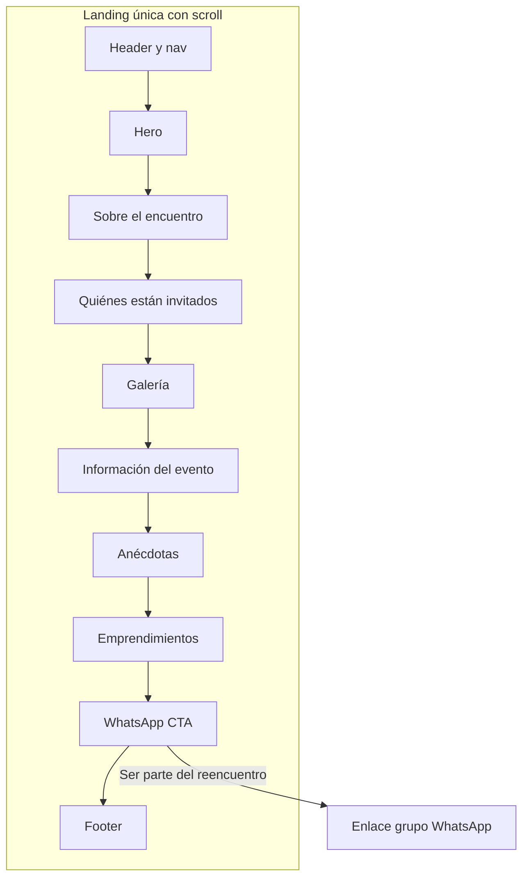

# Plan de implementación: The Last INALFU — 20 años después

Basado en el [brief](docs/BRIEF.md) y en la estructura actual del proyecto (landing veterinaria con HTML, TailwindCSS y JavaScript Vanilla). El trabajo consiste en **adaptar** el repositorio existente, no en reescribirlo desde cero.

---

## Mapeo template veterinaria → encuentro egresados

| Template actual            | Nueva sección                                                                                          |
| -------------------------- | ------------------------------------------------------------------------------------------------------ |
| Hero (#inicio)             | Hero del encuentro (The Last INALFU, 20 años después, CTA "Ser parte del reencuentro", imagen colegio) |
| Servicios (#servicios)     | **Sobre el encuentro** (texto narrativo/emocional)                                                     |
| Beneficios (#beneficios)   | **Quiénes están invitados**                                                                            |
| Testimonios (#testimonios) | **Anécdotas / recuerdos** (carousel de frases o contenido estático)                                    |
| Contacto (#contacto)       | **Acceso al grupo de WhatsApp** (solo CTA al enlace)                                                   |
| Footer                     | Cierre emocional + firma discreta Guineo Lab                                                           |

Secciones **nuevas** que se insertan en el flujo: **Galería** (~5 fotos), **Información del evento** (fecha, lugar, etc.), **Emprendimientos** (hasta 10 tarjetas, placeholders en V1).

---

## Archivos a modificar

### 1. [index.html](index.html)

**Por qué:** Es la única página; todo el contenido y la estructura de secciones viven aquí.

**Lógica:**

- **Head:** Cambiar `title`, `meta description` y contenido orientado a “The Last INALFU — 20 años después” y al encuentro de egresados.
- **Header:** Mantener header sticky, logo y menú hamburguesa. Reemplazar “VitalPaws” por “The Last INALFU” (o texto/logo del colegio). Enlaces del nav: Sobre el encuentro, Invitados, Galería, Evento, Anécdotas, Emprendimientos, WhatsApp (anclas a `#sobre-el-encuentro`, `#invitados`, `#galeria`, `#evento`, `#anecdotas`, `#emprendimientos`, `#whatsapp`). Mantener enlace “Saltar al contenido” y `aria-`* del menú.
- **Main — Secciones en orden:**
  1. **Hero (#inicio):** Título “The Last INALFU”, subtítulo “20 años después”, frase de invitación, botón principal “Ser parte del reencuentro” (enlace al ancla #whatsapp o directo al grupo WhatsApp), imagen principal del colegio (una sola, responsive). Mantener estructura de grid de dos columnas en desktop y bloques apilados en móvil; quitar el bloque de “primera consulta” y sustituir por la imagen o por un mensaje corto evocador.
  2. **Sobre el encuentro (#sobre-el-encuentro):** Sustituir la sección de servicios. Un bloque de texto (uno o dos párrafos) emocional y conmemorativo: qué significó esa época, el paso del tiempo, el valor del reencuentro y el espíritu del parche. Sin tarjetas de servicios; layout simple (título + texto centrado o en columna ancha).
  3. **Quiénes están invitados (#invitados):** Reutilizar la estructura de “beneficios”: título + texto que deje claro que no es solo para graduados, sino para quien compartió esa etapa (“Si hiciste parte de esa época, este encuentro es para ti”). Lista de ítems (quienes se graduaron, quienes estudiaron con la promoción, quienes parcharon, etc.) manteniendo el estilo de tarjetas o ítems actual.
  4. **Galería (#galeria):** Sección nueva. Título + grid de aproximadamente 5 imágenes (colegio, fiesta/carnaval, fotos antiguas del grupo, imágenes evocadoras). Usar `` con `alt` descriptivo; en V1 puede usarse un directorio `public/assets/images/` con nombres tipo `hero.jpg`, `galeria-1.jpg` … `galeria-5.jpg` o placeholders externos hasta tener las fotos reales.
  5. **Información del evento (#evento):** Sección nueva. Fecha destacada: **26 de diciembre de 2026**; mensaje de “reserva el día” y “encuentro después del final de la tarde”; espacio para añadir lugar u otra información después. Layout claro (fecha grande, texto breve).
  6. **Anécdotas / recuerdos (#anecdotas):** Reutilizar la estructura de testimonios: título “Anécdotas / recuerdos”, bloque donde se muestran frases o recuerdos (en V1 contenido estático o carousel con 2–3 frases del parche). Controles anterior/siguiente y dots si se mantiene el carousel. Sin formulario en V1.
  7. **Emprendimientos (#emprendimientos):** Sección nueva. Título + grid de tarjetas (reutilizar clase `.card`). Hasta 10 ítems; cada uno: nombre de la persona, nombre del emprendimiento, descripción corta, enlace o contacto. En V1 pueden ser placeholders (“Próximamente” o datos de ejemplo) con la estructura ya definida.
  8. **Acceso al grupo de WhatsApp (#whatsapp):** Sustituir la sección de contacto. Sin formulario. Título + texto breve + botón/enlace principal al grupo: `https://chat.whatsapp.com/H2MBfKG3SPA5kyL436iNJP` (target blank, rel noopener noreferrer). Mantener estilo de sección oscura (bg-slate-900 o similar) para contraste.
- **Footer:** Quitar enlaces de VitalPaws. Incluir cierre emocional breve, referencia al encuentro “The Last INALFU” y firma discreta “Guineo Lab” (texto o enlace pequeño).
- **Estilos y accesibilidad:** Mantener clases Tailwind y semántica (section, article, nav, headings). Sustituir referencias de “emerald” por la paleta del brief (verde institucional); si se define un color en `tailwind.config.js`, usarlo aquí. Conservar `reveal` en bloques que deban animarse al scroll.

---

### 2. [script.js](script.js)

**Por qué:** Toda la interactividad (menú, animaciones, carousel, formulario) está aquí; debe adaptarse al nuevo contenido y quitar lo que ya no aplique.

**Lógica:**

- **Menú responsive:** Dejar igual: botón toggle, mostrar/ocultar `#nav-menu`, actualizar `aria-expanded` y `aria-label`, cerrar al hacer clic en un `.nav-link` en móvil y al pulsar Escape. Los enlaces ya apuntarán a las nuevas anclas.
- **Reveal al scroll:** Mantener `IntersectionObserver` sobre `.reveal` y la clase `is-visible`; no cambiar lógica. Asegurar que en `index.html` las secciones que deban animarse lleven la clase `reveal`.
- **Anécdotas (ex testimoniales):** Reutilizar la misma lógica de carousel: elementos con `data-testimonial` (o renombrar a `data-anecdota`), botones anterior/siguiente, dots generados por JS, índice actual, `renderTestimonial` → renombrar a algo como `renderAnécdota` y mostrar/ocultar el ítem activo. Autoplay opcional (como ahora). Si en V1 se decide contenido estático sin carousel, este bloque se puede comentar o simplificar.
- **Formulario de contacto:** Eliminar o comentar el listener del formulario y la validación (nombre, teléfono, motivo). En V1 no hay formulario en la sección WhatsApp.
- **Galería:** En V1 el brief no exige lightbox; si se desea una interacción mínima (por ejemplo click para ampliar), se puede añadir un bloque pequeño que abra la imagen en modal o en nueva pestaña. No obligatorio para DoD.

---

### 3. [tailwind.config.js](tailwind.config.js)

**Por qué:** Centralizar el verde institucional y asegurar que el build siga incluyendo `index.html` y `script.js`.

**Lógica:**

- Mantener `content` como está (`["./index.html", "./script.js", "./src/**/*.{html,js}"]`).
- Opcional: en `theme.extend.colors` definir un color tipo `inalfu: { DEFAULT: '#...', 600: '...', 700: '...' }` con el verde del colegio para usarlo en lugar de `emerald` en el HTML y en `input.css`. Si no se tiene el hex exacto, se puede seguir usando `emerald` como aproximación al “verde institucional”.
- No añadir plugins ni dependencias; mantener configuración mínima.

---

### 4. [src/styles/input.css](src/styles/input.css)

**Por qué:** Es la fuente de estilos; las clases `@layer components` y `@layer utilities` se compilan a `public/assets/css/styles.css`. Ajustar aquí garantiza un solo lugar para botones, cards y reveal.

**Lógica:**

- Mantener estructura: `@tailwind base/components/utilities`, `@layer components` con `.btn-primary`, `.btn-secondary`, `.card`, `.card-title`, `.card-text`, y `@layer utilities` con `.reveal` y `.reveal.is-visible`.
- Si en `tailwind.config.js` se añade el color institucional (p. ej. `inalfu`), cambiar en `.btn-primary` y `.btn-secondary` de `emerald-`* a `inalfu-`* (o las variantes que se definan). Si no, dejar `emerald` como verde institucional.
- No eliminar `.card` ni `.card-text`: se usarán en la sección de emprendimientos. Opcional: añadir una clase para el CTA principal del hero si se desea un tamaño mayor (p. ej. `btn-hero` con `text-base` o `px-6 py-4`).

---

### 5. [package.json](package.json)

**Por qué:** Reflejar el nombre y propósito del proyecto para mantenimiento y documentación.

**Lógica:**

- Actualizar `name` (p. ej. `"the-last-inalfu"` o mantener y añadir descripción), `description` a algo como “Landing conmemorativa encuentro egresados The Last INALFU — 20 años después”. Opcional: ajustar `author` o `repository` si el proyecto se bifurca. Los scripts `css:watch` y `css:build` no cambian; siguen usando `./src/styles/input.css` y `./public/assets/css/styles.css`.

---

## Archivos a crear

### 6. Carpeta de imágenes y placeholder de contenido

**Ruta sugerida:** `public/assets/images/`

**Lógica:**

- Crear la carpeta si no existe.
- Añadir un archivo **README.txt** o **IMAGENES.md** que liste los recursos necesarios para cumplir el brief:
  - **Hero:** 1 imagen principal del colegio (recomendado tamaño o relación de aspecto para desktop y móvil).
  - **Galería:** 5 imágenes (colegio, fiesta/carnaval, fotos antiguas del grupo, imágenes evocadoras).
- En `index.html` usar rutas como `public/assets/images/hero.jpg` y `public/assets/images/galeria-1.jpg` … `galeria-5.jpg`. Mientras no existan las fotos reales, se puede:
  - usar un servicio de placeholders (p. ej. `https://placehold.co/1200x600/1a5f4a/white?text=The+Last+INALFU`) en el `src` del ``, o
  - dejar las rutas locales y que el cliente reemplace los archivos.

No se crean nuevos archivos HTML ni JS; toda la lógica y la estructura viven en los archivos modificados anteriores.

---

## Orden sugerido de implementación

1. **Configuración y estilos base**
  Ajustar `tailwind.config.js` (color institucional si aplica) y `src/styles/input.css` (botones/cards con verde). Ejecutar `npm run css:build` y comprobar que no se rompe nada.
2. **Estructura y contenido de la página**
  Modificar `index.html` en este orden: head y header (marca + navegación); hero; sobre el encuentro; invitados; galería (con rutas o placeholders); información del evento; anécdotas (markup listo para carousel); emprendimientos (placeholders); WhatsApp; footer.
3. **Interactividad**
  Adaptar `script.js`: menú (solo verificar anclas), reveal, carousel de anécdotas; eliminar lógica del formulario de contacto.
4. **Assets y documentación**
  Crear `public/assets/images/` y el README/IMAGENES.md con la lista de imágenes. Probar en local que la ruta del hero y de la galería funcionen (con placeholders o con archivos de prueba).
5. **Revisión final**
  Comprobar DoD del brief: todas las secciones presentes, responsive, CTA a WhatsApp visible, tono nostálgico y cuidado, sin parecer plantilla de veterinaria. Ajustar textos y detalles visuales (espaciado, tipografía, contraste).

---

## Resumen de archivos

| Acción    | Archivo                                      | Motivo principal                                                                                                                                         |
| --------- | -------------------------------------------- | -------------------------------------------------------------------------------------------------------------------------------------------------------- |
| Modificar | [index.html](index.html)                     | Sustituir todo el contenido y secciones por el encuentro INALFU (hero, sobre, invitados, galería, evento, anécdotas, emprendimientos, WhatsApp, footer). |
| Modificar | [script.js](script.js)                       | Mantener menú y reveal; reutilizar carousel para anécdotas; quitar manejo del formulario.                                                                |
| Modificar | [tailwind.config.js](tailwind.config.js)     | Opcional: color verde institucional; mantener `content`.                                                                                                 |
| Modificar | [src/styles/input.css](src/styles/input.css) | Ajustar botones/cards al verde institucional si se define; conservar reveal y cards.                                                                     |
| Modificar | [package.json](package.json)                 | Nombre y descripción del proyecto.                                                                                                                       |
| Crear     | `public/assets/images/` + README/IMAGENES.md | Documentar y preparar rutas para hero y 5 fotos de galería; usar placeholders o rutas locales.                                                           |

---

## Diagrama de flujo de la página (conceptual)

Con este plan se aprovecha al máximo la estructura y los recursos del proyecto anterior y se cumple el brief de “The Last INALFU — 20 años después” para la versión 1.